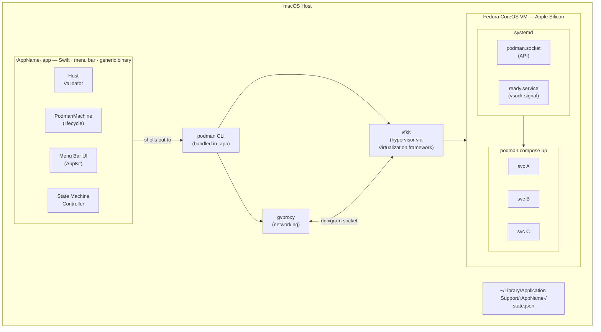
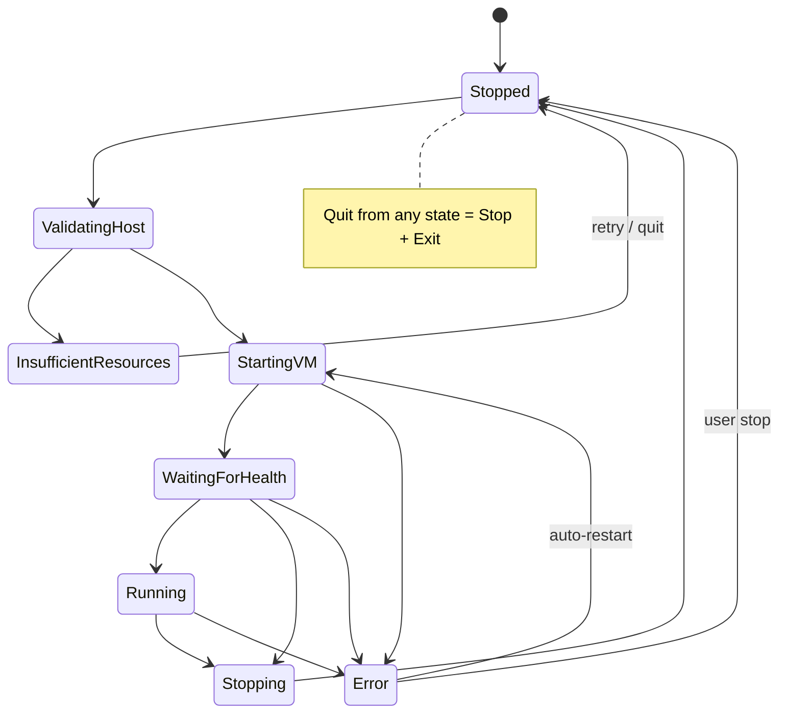

# Containerfy Architecture

An open-source tool that packages a Docker Compose application into a native macOS menu bar app with an embedded Linux VM. One-click install for end users — no Docker knowledge, no container runtime on the host.

The developer's only input is a single `docker-compose.yml` with an `x-containerfy` extension block. No separate manifest file.

## Architecture



**Key constraint:** The macOS app does NOT implement container tooling. It shells out to `podman machine` for VM lifecycle and `podman compose` for container orchestration.

**Unified binary:** The same Swift binary serves as both the developer CLI (`containerfy pack`) and the end-user GUI app (menu bar). CLI mode is activated when `pack` is the first argument; otherwise the GUI launches.

**VM runtime:** Podman machine manages the full VM lifecycle using vfkit (Apple Virtualization.framework hypervisor) and gvproxy (virtual networking with DHCP, DNS, NAT, and port forwarding). The VM runs Fedora CoreOS with systemd.

---

## Components

### Swift Menu Bar App (generic binary)

The same compiled `.app` binary is used for every appliance. It reads `docker-compose.yml` from its own `Contents/Resources/` at runtime, parses the `x-containerfy` block and service definitions to determine behavior: app name, menu items, port forwarding, health checks, etc.

| Aspect | Decision |
|---|---|
| Framework | AppKit `NSStatusItem` |
| Min target | macOS 14.0 (VM pause/resume, stable vsock, Virtualization.framework maturity) |
| Entitlements | `com.apple.security.virtualization`, `com.apple.security.hypervisor` |
| Hardened Runtime | Required — `--options runtime` for notarized builds |
| Sandbox | No — Virtualization.framework requires unsandboxed execution |
| Distribution | Signed `.app` in `.dmg`, notarized via `containerfy pack`, not App Store |

**State machine:**



All transitions are `@MainActor`-isolated. `VZVirtualMachineDelegate` callbacks dispatch to `@MainActor` before touching state. Transitions are guarded: "if current state is X, move to Y; otherwise ignore and log."

**Menu bar renders dynamically from compose file:**
- Status icon reflects current state
- "Open" items auto-generated from services with `ports:` — service name becomes the label (title-cased, hyphens → spaces), first host port becomes the URL
- Restart / Stop / View Logs / Preferences / Quit (Quit = Stop VM + exit)

**PodmanMachine** wraps `podman machine` CLI:
- Derives machine name from app identifier (e.g. `containerfy-test-app`)
- `podman machine init` with CPU, memory, disk from `x-containerfy` block — downloads Fedora CoreOS image on first run
- `podman machine start` boots existing machine
- `podman compose up -d` starts containers
- Shutdown: `podman compose down` → `podman machine stop`
- Destroy: `podman machine rm -f`
- Bundled helper binaries (podman, gvproxy, vfkit) found via `CONTAINERS_HELPER_BINARY_DIR` env var pointing to `.app/Contents/MacOS/`

**Host validator** runs before VM creation — pure function, no side effects:
- Hard fail: insufficient memory, disk, wrong arch, old macOS, no VZ support
- Soft warn: below recommended CPU cores
- Each failure carries a `guidance` string so users see what to do, not just what's wrong

**Port forwarding:** Handled by gvproxy — compose `ports:` mappings are forwarded from host to VM automatically via podman machine's networking layer.

### Swift CLI (`containerfy pack`) — Developer-Facing

The same Swift binary serves dual roles: CLI tool for developers and GUI app for end users. When invoked with `containerfy pack`, it runs in CLI mode (no NSApplication). Otherwise it launches the menu bar GUI.

```
containerfy pack \
  --compose ./docker-compose.yml \
  --output ./MyApp \
  --signed myprofile
```

What it does:
1. Parses `docker-compose.yml` — validates `x-containerfy` block, rejects hard-rejected keywords (see Compose Passthrough Model)
2. Assembles the .app bundle: copies compose file, env files, generates Info.plist, embeds itself as the app binary
3. Embeds bundled helper binaries (podman, gvproxy, vfkit) into `.app/Contents/MacOS/`
4. Signs vfkit with required entitlements (virtualization, network.server, network.client)
5. If `--signed`: signs `.app` with Hardened Runtime, creates `.dmg`, submits for notarization, staples ticket

**Build requirements:**
- No Docker required on the developer's machine.
- Helper binaries (podman, gvproxy, vfkit) must be in `.build/debug/` — run `bash bootstrap.sh` to download them.
- Xcode Command Line Tools (`xcode-select --install`) for signing and notarization (only needed with `--signed`). Free.
- Apple Developer account ($99/year) for the signing certificate (only needed with `--signed`). Required for notarized distribution — unsigned apps are blocked by Gatekeeper.

**Installation:**
```bash
curl -fsSL https://containerfy.dev/install.sh | bash
```

This downloads the `containerfy` binary to `/usr/local/bin/`.

**The .app bundle layout produced by the CLI:**
```
MyApp.app/Contents/
├── MacOS/
│   ├── Containerfy           # Generic Swift binary (same for all appliances)
│   ├── podman                # Podman CLI (manages machine + compose)
│   ├── gvproxy               # Virtual networking (DHCP, DNS, NAT, port forwarding)
│   └── vfkit                 # Hypervisor (Apple Virtualization.framework)
├── Resources/
│   ├── docker-compose.yml    # Compose file (includes x-containerfy config)
│   └── *.env                 # Any env files referenced by env_file: (if present)
└── Info.plist
```

Entitlements are embedded in the code signature at build time, not shipped as a file.

### CLI Reference

```
containerfy pack [flags]
```

| Flag | Default | Description |
|---|---|---|
| `--compose` | `./docker-compose.yml` | Path to compose file |
| `--output` | `./<name>` (from `x-containerfy.name`) | Output path (produces `.app` or `.app` + `.dmg`) |
| `--signed <keychain-profile>` | | Sign `.app`, create `.dmg`, notarize, and staple. Requires a Developer ID certificate. |

**Unsigned build** (default): produces `.app` only. No signing, no `.dmg`. Useful for local testing. End users will see a Gatekeeper warning.

**Signed build** (`--signed <profile>`): auto-detects Developer ID signing identity (prompts if multiple found), signs `.app` with Hardened Runtime and entitlements (`codesign --force --sign <hash> --options runtime --timestamp --deep`), verifies signature (`codesign --verify --deep --strict`), creates compressed `.dmg` with Applications symlink (`hdiutil create -format UDZO`), signs the `.dmg`, submits for notarization (`xcrun notarytool submit --keychain-profile <profile> --wait`), and staples the ticket (`xcrun stapler staple` — non-fatal on failure, Gatekeeper verifies online).

**One-time credential setup:**
```bash
xcrun notarytool store-credentials <profile-name>
# Prompts for Apple ID, team ID, and app-specific password
# Credentials are stored in the macOS keychain
```

```
containerfy --help
```

Shows available commands. With no arguments, launches the GUI menu bar app.

### Linux VM (Podman Machine)

Fedora CoreOS (aarch64), managed entirely by `podman machine`. The VM image is downloaded automatically on first `podman machine init`.

**Storage:** Podman machine manages its own disk image. Disk size is set at init time via `--disk-size` from `x-containerfy.vm.disk_mb`.

**Boot:** EFI bootloader (single raw disk image, no separate kernel/initrd). Provisioned via Ignition on first boot (SSH keys, systemd units, podman socket activation).

**Ready signal:** Guest systemd unit sends "Ready\n" over vsock port 1025 to signal boot completion.

**Networking:** gvproxy provides a virtual network (192.168.127.0/24) with DHCP, DNS, and NAT. Port forwarding from host to VM is handled by gvproxy's HTTP API.

**Container runtime:** Podman (socket-activated via systemd), with Docker socket compatibility symlink at `/run/docker.sock`.

---

## `docker-compose.yml` with `x-containerfy`

All Containerfy configuration lives inside the compose file using the standard `x-` extension mechanism. The compose file remains fully valid — `docker compose up` still works locally for development.

### Example: Paperless-ngx

A self-hosted document management system with OCR. Five services, but only the web UI is user-facing — the rest communicate internally over the compose network.

```yaml
x-containerfy:
  name: "paperless"
  version: "2.14.0"
  identifier: "github.com/paperless-ngx/paperless-ngx"
  display_name: "Paperless"
  icon: "icon.png"
  vm:
    cpu:
        min: 2
        recommended: 4
    memory_mb:
        min: 2048
        recommended: 4096
    disk_mb: 16384
  healthcheck:
    url: "http://127.0.0.1:8000"

services:
  paperless:                           # → menu item: "Open Paperless"
    image: ghcr.io/paperless-ngx/paperless-ngx:latest
    ports:
      - "8000:8000"
    depends_on:
      - db
      - broker
      - gotenberg
      - tika
    environment:
      PAPERLESS_REDIS: redis://broker:6379
      PAPERLESS_DBHOST: db
      PAPERLESS_TIKA_ENABLED: 1
      PAPERLESS_TIKA_GOTENBERG_ENDPOINT: http://gotenberg:3000
      PAPERLESS_TIKA_ENDPOINT: http://tika:9998
    volumes:
      - data:/usr/src/paperless/data
      - media:/usr/src/paperless/media

  broker:                              # internal — no ports, no menu item
    image: redis:7-alpine

  db:                                  # internal — no ports, no menu item
    image: postgres:16-alpine
    environment:
      POSTGRES_DB: paperless
      POSTGRES_USER: paperless
      POSTGRES_PASSWORD: paperless
    volumes:
      - pgdata:/var/lib/postgresql/data

  gotenberg:                           # internal — document conversion
    image: gotenberg/gotenberg:8
    command:
      - "gotenberg"
      - "--chromium-disable-javascript=true"

  tika:                                # internal — OCR processing
    image: apache/tika:latest

volumes:
  data:
  media:
  pgdata:
```

This produces a single menu item: **"Open Paperless"** → `http://127.0.0.1:8000`. The broker, database, Gotenberg, and Tika are invisible to the end user — they have no `ports:` and communicate by service name over the compose network.

### Menu item generation rules

Services with `ports:` automatically become "Open" menu items:
- **Label**: service name, title-cased, hyphens/underscores → spaces (`paperless` → "Paperless")
- **URL**: `http://127.0.0.1:<first host port>`
- Services without `ports:` are internal-only and don't appear in the menu

**Only expose ports for services the end user should see.** Internal services (databases, caches, queues) talk to each other by service name — no `ports:` needed, no port conflicts possible.

### `x-containerfy` field reference

```yaml
x-containerfy:
  name: "my-app"                     # [REQUIRED] string, 1-64 chars, [a-zA-Z0-9-]
  version: "1.0.0"                   # [REQUIRED] semver
  identifier: "com.example.myapp"    # [REQUIRED] unique ID (reverse-DNS, GitHub URL, etc.)
  display_name: "My App"             # [OPTIONAL] shown in menu bar, default: name title-cased
  icon: "icon.png"                   # [OPTIONAL] path relative to compose file

  vm:
    cpu:
      min: 2                         # [REQUIRED] 1-16
      recommended: 4                 # [OPTIONAL] >= min, default: min
    memory_mb:
      min: 2048                      # [REQUIRED] 512-32768
      recommended: 4096              # [OPTIONAL] >= min, default: min
    disk_mb: 10240                   # [REQUIRED] >= 1024

  healthcheck:
    url: "http://127.0.0.1:8080/health"  # [REQUIRED] must target 127.0.0.1
    interval_seconds: 10             # [OPTIONAL] 5-60, default: 10
    timeout_seconds: 5               # [OPTIONAL] 1-30, default: 5
    startup_timeout_seconds: 120     # [OPTIONAL] 30-600, default: 120
```

**Validation rules** (enforced by `containerfy pack` at build time):

| Field | Constraint |
|---|---|
| `name` | `^[a-zA-Z][a-zA-Z0-9-]{0,63}$` (leading alpha required) |
| `version` | Valid semver |
| `cpu.min` | 1-16, `recommended` >= `min` |
| `memory_mb.min` | 512-32768, `recommended` >= `min` |
| `disk_mb` | >= 1024 |
| `healthcheck.url` | Valid HTTP URL, host must be `127.0.0.1`, port must match a host port in some service's `ports:` mapping |
| At least one service | Must have `ports:` (otherwise nothing to expose) |

**Resource allocation at runtime:**
- CPU: `min(recommended, hostCores - 1)`, floored at `min`
- Memory: use `recommended` if host has 2x that free, otherwise use `min`

---

## Compose Passthrough Model

Containerfy passes the compose file to `podman compose up` inside the VM **unchanged**. The file is not rewritten, templated, or subset-filtered.

**Containerfy only parses these fields** (everything else is ignored and passed through):

| Field | Why Containerfy reads it |
|---|---|
| `services[*].image` | Pull images via `podman compose` at runtime |
| `services[*].ports` | Set up vsock↔TCP port forwarding on the host; generate menu items |
| Top-level `volumes` | Named volumes managed by Podman inside the VM |
| `services[*].env_file` | Bundle referenced `.env` files into root image alongside compose file |

**Hard-rejected keywords** (caught by `containerfy pack` at build time):

| Keyword | Reason |
|---|---|
| `build:` | No build context in the VM. Pre-built images only. |
| Bind mount volumes (e.g. `./data:/app/data`) | Host paths don't exist inside the VM. Named volumes only. |
| `extends:` | Requires resolving external files that may not be bundled. |
| `profiles:` | All services in the file are always started. No partial-stack support in v1. |
| `network_mode: host` | Service binds to VM network, invisible to vsock port forwarder. Breaks silently. |
| `env_file:` without bundled files | References must resolve inside VM. `containerfy pack` bundles referenced env files automatically; rejects if file not found. |

**Everything else passes through** — `command`, `entrypoint`, `depends_on`, `restart`, `networks`, `configs`, `secrets`, `labels`, `healthcheck`, `deploy`, `logging`, `cap_add`, `privileged`, `user`, `working_dir`, `stdin_open`, `tty`, etc. If Docker Compose supports it, it works.

---

## V1 Scope

**In:**
- Apple Silicon, macOS 14+
- Single appliance per `.app` (1:1)
- Podman + Compose v2 in Fedora CoreOS VM (via `podman machine`)
- Full Compose passthrough — all features work except: `build:`, bind mount volumes, `extends:`, `profiles:`
- All config in one `docker-compose.yml` via `x-containerfy` extension
- Menu items auto-generated from services with `ports:`
- gvproxy port forwarding, HTTP health polling
- Menu bar: status icon, Open (per exposed service), Restart, Stop, Logs, Quit
- Persistent data (podman machine disk), launch at login
- Host validation (hard fail + soft warn)
- Sleep/wake recovery, crash recovery
- Unified Swift CLI to package `.app` bundles (no Docker required, bundles podman/gvproxy/vfkit)

**Hard-rejected Compose keywords** (see Compose Passthrough Model):
- `build:`, bind mount volumes, `extends:`, `profiles:`

**Out (v2+):**
- Intel Macs, macOS 12-13
- Image building on user machines (`build:`)
- Multiple appliances, auto-update, App Store
- GPU passthrough, SSH access, snapshot/rollback
- Windows/Linux host, HTTPS termination
- Custom menu labels per service (v2: via compose `labels:`)
- Custom URL paths per service (v2: via compose `labels:`)
- `profiles:` support (partial-stack selection)

---

## Risks

| Risk | Impact | Mitigation |
|---|---|---|
| **Sleep/wake** — VM clock skew, stale connections after resume | Health checks fail, containers misbehave | Podman machine handles VM suspend/resume. Auto-restart if health fails. |
| **Disk corruption** — force-quit, power loss, kernel panic | VM won't boot | Podman machine manages disk images. `podman machine rm` + `init` recovers from corruption. |
| **Port conflicts** — another app on the same port | App can't start | Test-bind ports before forwarding. Hard error with clear message. No auto-reassign in v1 (breaks compose contract). |
| **Virtualization.framework edge cases** — vfkit crashes, gvproxy hangs | Crashes, hangs | Pin macOS 14+ (stable generation). Podman machine handles vfkit/gvproxy lifecycle. `podman machine rm` + `init` recovers. |
| **Memory pressure / OOM** — macOS jetsam kills entire app process | Data loss, app crash | Validate available memory before VM creation. Allocate conservatively. Jetsam kills the process — no runtime handling possible. Crash recovery on next launch detects stale state file and offers reset. |
| **First-launch VM download** — Fedora CoreOS image download on first `podman machine init` | User thinks app is hung | Show progress. Subsequent launches reuse cached image. |
| **Download size** — Fedora CoreOS VM image ~700 MB | Friction for first launch | Downloaded once, cached by podman. Advise developers to use slim container images. |
| **Notarization dependency** — Apple's notarization service availability, processing delays, policy changes | Developers can't ship signed builds during outages | Default is unsigned — signing only runs with `--signed`. Notarization is async (Apple side) — CLI polls with timeout. Document manual `xcrun notarytool` fallback if automation fails. |
| **Secrets visible in bundle** — environment variables in `docker-compose.yml` are readable inside the `.app` | Credentials exposed if bundle is shared or inspected | Document clearly: compose file is not encrypted. Advise developers to use runtime secret injection (container entrypoints that read from mounted volumes) rather than hardcoding secrets in environment variables. v2 scope for encrypted secrets support. |

---

## Locked Decisions

| Decision | Choice | Rationale |
|---|---|---|
| Config format | `x-containerfy` in `docker-compose.yml` | Single file. Standard compose extension mechanism. File stays valid for local `docker compose up`. |
| Container runtime in VM | Podman + Compose v2 (via `podman machine`) | Compose compatibility. Eliminates need for custom VM image — uses Fedora CoreOS default. |
| Host↔VM communication | gvproxy + vfkit (managed by podman machine) | Deterministic networking. Port forwarding, DNS, DHCP handled by gvproxy. |
| Storage model | Single disk (podman machine managed) | Podman machine handles disk provisioning and lifecycle. |
| Health checks | HTTP GET polling through port forwarder | Tests full chain end-to-end. Stateless, debuggable (just curl it). |
| Menu item generation | Auto from services with `ports:` | Zero config. Service name = label. Encourages clean appliance design (don't expose internal services). |
| VM management | Shell out to `podman machine` CLI | No custom VM code. Leverages Podman's mature vfkit/gvproxy/ignition stack. |
| macOS app language | Swift, AppKit NSStatusItem | Native menu bar control. No SwiftUI quirks. |
| CLI language | Swift (unified binary) | Same binary for CLI (`containerfy pack`) and GUI. One language, one toolchain. VM-based build eliminates Docker requirement. |
| Build system (Swift) | SPM, no .xcodeproj | Merge-friendly, scriptable, CI-native. |
| Helper binaries | Bundled podman/gvproxy/vfkit in .app | Self-contained distribution. No system podman dependency for end users. |
| Min macOS | 14.0 | VM pause/resume for sleep/wake, stable vsock, mature Virtualization.framework. 13 lacks clean suspend and isn't worth the workarounds. |
| Compose passthrough | Pass full compose file to Docker Compose in VM | Avoids fragile allowlist. Only parse what Containerfy needs (images, ports, volumes). Reject only what can't work. |

---

## Resolved Questions

| Question | Decision | Rationale |
|---|---|---|
| **Build bootstrapping** | `bootstrap.sh` + podman machine; no Docker required on dev machine | `bootstrap.sh` downloads pinned podman/gvproxy/vfkit. `containerfy pack` bundles them into `.app`. Developer installs one binary via `install.sh`. |
| **Update mechanism** | Manual re-download in v1; no data migration system | Developer publishes a new `.dmg`. User drags new `.app` over old one. Podman machine data persists separately. Data migration is the developer's responsibility (container entrypoints). |
| **Sleep/wake** | Bumped min macOS to 14; podman machine handles VM suspend/resume | Eliminates manual VM lifecycle complexity. macOS 13 isn't worth the workarounds. |
| **Volume disk growth** | Developer sets `disk_mb` conservatively; no auto-resize | No runtime resize complexity. `disk_mb` maps to `podman machine init --disk-size`. |
| **Log streaming** | `podman compose logs` in v1 | Logs window shows recent lines via `podman compose logs --tail`. |
| **Quit vs Stop** | Quit = Stop VM + exit process | Simpler model. No "app running with VM stopped" state. Fewer states to manage. |
| **`env_file:` handling** | `containerfy pack` bundles referenced env files into `.app` Resources | Common in real-world compose files. Silent runtime failure if missing. Reject at pack time if file not found. |
