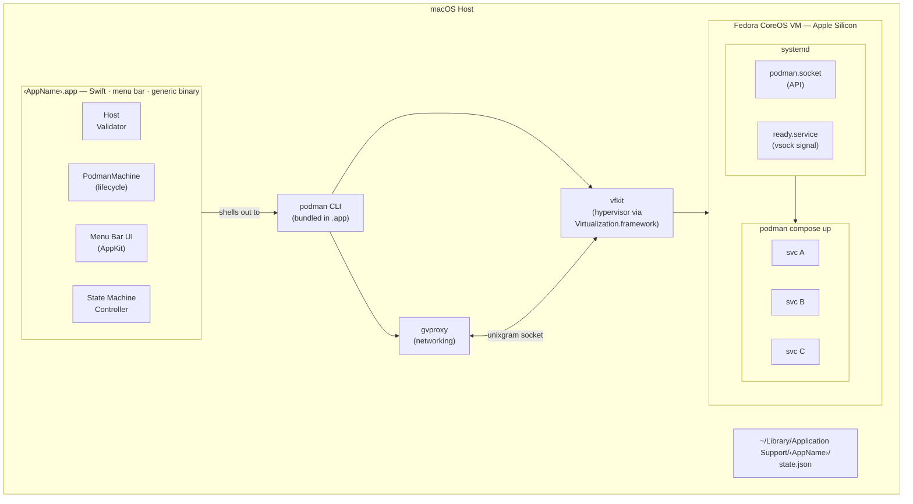
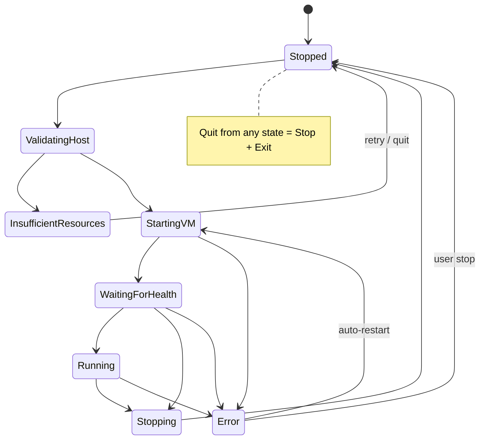

# Architecture

## Overview

**Key constraint:** The macOS app does NOT implement container tooling. It shells out to `podman machine` for VM lifecycle and `podman compose` for container orchestration.

**Unified binary:** The same Swift binary serves as both the developer CLI (`containerfy pack`) and the end-user GUI app (menu bar). CLI mode is activated when `pack` is the first argument; otherwise the GUI launches.

**VM runtime:** Podman machine manages the full VM lifecycle using vfkit (Apple Virtualization.framework hypervisor) and gvproxy (virtual networking with DHCP, DNS, NAT, and port forwarding). The VM runs Fedora CoreOS with systemd.

## Components

### Swift Menu Bar App (Generic Binary)

The same compiled `.app` binary is used for every appliance. It reads `docker-compose.yml` from its own `Contents/Resources/` at runtime, parses the `x-containerfy` block and service definitions to determine behavior: app name, menu items, port forwarding, health checks, etc.

| Aspect | Decision |
|---|---|
| Framework | AppKit `NSStatusItem` |
| Min target | macOS 14.0 (VM pause/resume, stable vsock, Virtualization.framework maturity) |
| Entitlements | `com.apple.security.virtualization`, `com.apple.security.hypervisor` |
| Hardened Runtime | Required — `--options runtime` for notarized builds |
| Sandbox | No — Virtualization.framework requires unsandboxed execution |
| Distribution | Signed `.app` in `.dmg`, notarized via `containerfy pack`, not App Store |

**Menu bar renders dynamically from compose file:**
- Status icon reflects current state
- "Open" items auto-generated from services with `ports:` — service name becomes the label (title-cased, hyphens replaced with spaces), first host port becomes the URL
- Restart / Stop / View Logs / Preferences / Quit (Quit = Stop VM + exit)

### State Machine

All transitions are `@MainActor`-isolated. `VZVirtualMachineDelegate` callbacks dispatch to `@MainActor` before touching state. Transitions are guarded: "if current state is X, move to Y; otherwise ignore and log."

### PodmanMachine

Wraps `podman machine` CLI:
- Derives machine name from app identifier (e.g. `containerfy-test-app`)
- `podman machine init` with CPU, memory, disk from `x-containerfy` block — downloads Fedora CoreOS image on first run
- `podman machine start` boots existing machine
- `podman compose up -d` starts containers
- Shutdown: `podman compose down` then `podman machine stop`
- Destroy: `podman machine rm -f`
- Bundled helper binaries (podman, gvproxy, vfkit) found via `CONTAINERS_HELPER_BINARY_DIR` env var pointing to `.app/Contents/MacOS/`

### Host Validator

Runs before VM creation — pure function, no side effects:
- Hard fail: insufficient memory, disk, wrong arch, old macOS, no VZ support
- Soft warn: below recommended CPU cores
- Each failure carries a `guidance` string so users see what to do, not just what's wrong

### Port Forwarding

Handled by gvproxy — compose `ports:` mappings are forwarded from host to VM automatically via podman machine's networking layer.

### Linux VM (Podman Machine)

Fedora CoreOS (aarch64), managed entirely by `podman machine`. The VM image is downloaded automatically on first `podman machine init`.

- **Storage:** Podman machine manages its own disk image. Disk size is set at init time via `--disk-size` from `x-containerfy.vm.disk_mb`.
- **Boot:** EFI bootloader (single raw disk image, no separate kernel/initrd). Provisioned via Ignition on first boot (SSH keys, systemd units, podman socket activation).
- **Ready signal:** Guest systemd unit sends "Ready\n" over vsock port 1025 to signal boot completion.
- **Networking:** gvproxy provides a virtual network (192.168.127.0/24) with DHCP, DNS, and NAT. Port forwarding from host to VM is handled by gvproxy's HTTP API.
- **Container runtime:** Podman (socket-activated via systemd), with Docker socket compatibility symlink at `/run/docker.sock`.
